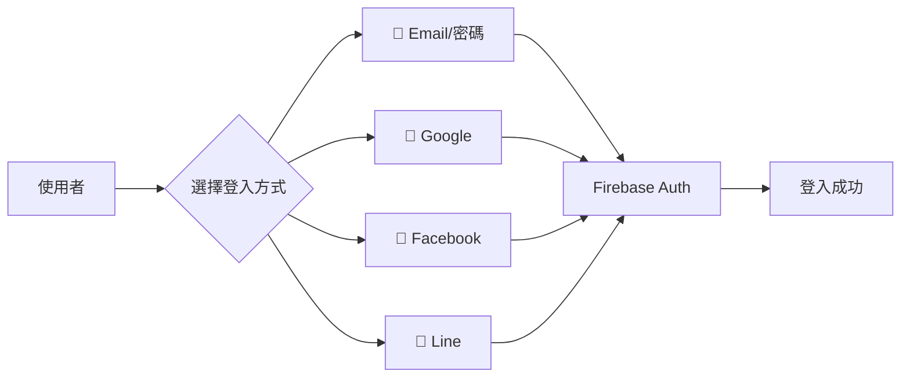
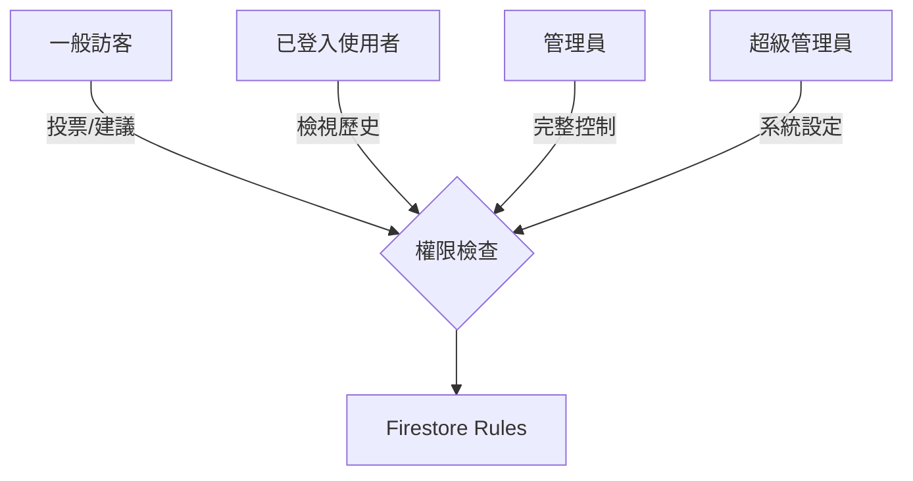
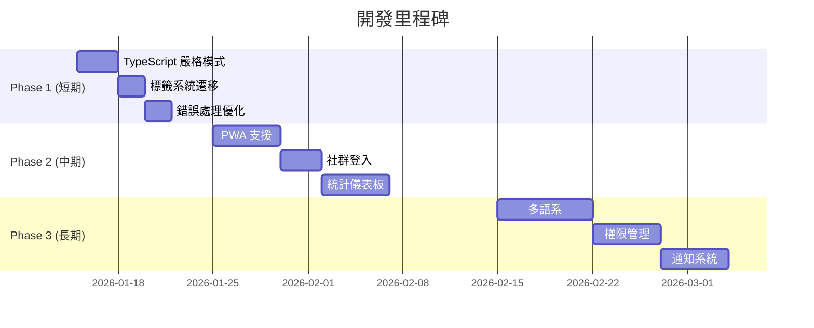

# 🎸 互動式吉他彈唱點播平台 - 未來開發路線圖

v2.0 純前端架構轉換完成後的開發建議與優化方向。

> **當前版本**: v2.0.0 (2026-01-12)  
> **架構**: React + Firebase (純前端)  
> **部署**: GitHub Pages

---

## 📊 開發優先級矩陣

```mermaid
quadrantChart
    title 功能優先級矩陣
    x-axis 實施難度 (低 --> 高)
    y-axis 使用者價值 (低 --> 高)
    quadrant-1 優先實施
    quadrant-2 計劃中
    quadrant-3 可延後
    quadrant-4 需評估
    TypeScript 嚴格模式: [0.3, 0.4]
    PWA 離線支援: [0.5, 0.85]
    歌詞同步播放: [0.75, 0.9]
    社群登入: [0.4, 0.7]
    點播歷史: [0.3, 0.6]
    數據分析: [0.6, 0.55]
    多語系: [0.7, 0.3]
    API 限流: [0.8, 0.65]
```

---

## 🔥 Phase 1: 短期優化 (1-2 週)

### 1.1 TypeScript 嚴格模式恢復

> [!WARNING]
> 目前 `strict` 和 `noImplicitAny` 已設為 `false`，這可能隱藏潛在問題。

**待修復項目**:

| 檔案 | 問題 | 建議修復 |
|------|------|----------|
| `TagSelector.tsx` | 仍使用舊 API 呼叫 | 改用 Firestore 函式 |
| `MusicPlayer.tsx` | 隱式 any 型別 | 添加明確型別註解 |
| `RankingBoard.tsx` | 複雜狀態型別 | 使用 TypeScript 泛型 |

**修復步驟**:

```typescript
// tsconfig.json 恢復嚴格模式
{
  "compilerOptions": {
    "strict": true,
    "noImplicitAny": true,
    // 新增以幫助遷移
    "strictNullChecks": true,
    "strictFunctionTypes": true
  }
}
```

---

### 1.2 標籤系統 Firestore 遷移

`TagSelector.tsx` 仍使用 `/api/tags` 呼叫，需要更新：

```typescript
// client/src/hooks/use-tags.ts (建議新增)
import { getTags, addTag, getSongTags, addSongTag, removeSongTag } from '@/lib/firestore';

export function useTags() {
  const [tags, setTags] = useState<Tag[]>([]);
  
  useEffect(() => {
    getTags().then(setTags);
  }, []);
  
  return { tags, addTag, getSongTags, addSongTag, removeSongTag };
}
```

---

### 1.3 錯誤處理與使用者回饋

**目前問題**:
- Firestore 錯誤訊息不友善
- 網路中斷沒有提示

**建議實施**:

```typescript
// client/src/lib/error-handler.ts (建議新增)
export function handleFirestoreError(error: FirebaseError): string {
  const messages: Record<string, string> = {
    'permission-denied': '您沒有權限執行此操作',
    'unavailable': '伺服器暫時無法使用，請稍後再試',
    'not-found': '找不到請求的資源',
    'already-exists': '此項目已存在',
  };
  return messages[error.code] || '發生未知錯誤';
}
```

---

## 🚀 Phase 2: 中期功能擴展 (2-4 週)

### 2.1 PWA 離線支援

| 功能 | 說明 | 優先級 |
|------|------|--------|
| Service Worker | 緩存靜態資源 | ⭐⭐⭐ |
| 離線歌單檢視 | 離線時顯示已快取的歌曲 | ⭐⭐⭐ |
| 安裝提示 | 引導使用者安裝 PWA | ⭐⭐ |
| 背景同步 | 離線投票後上線自動同步 | ⭐ |

**實施步驟**:

```bash
# 1. 安裝 vite-plugin-pwa
npm install vite-plugin-pwa -D

# 2. 配置 vite.config.ts
```

```typescript
// vite.config.ts
import { VitePWA } from 'vite-plugin-pwa';

export default defineConfig({
  plugins: [
    react(),
    VitePWA({
      registerType: 'autoUpdate',
      manifest: {
        name: '吉他點歌系統',
        short_name: '點歌',
        theme_color: '#f59e0b',
        icons: [/* ... */]
      },
      workbox: {
        globPatterns: ['**/*.{js,css,html,ico,png,svg}']
      }
    })
  ]
});
```

---

### 2.2 社群登入整合

支援多種登入方式提升使用者體驗：



**程式碼範例**:

```typescript
// client/src/lib/auth.ts 擴充
import { GoogleAuthProvider, signInWithPopup } from 'firebase/auth';

export async function signInWithGoogle() {
  const provider = new GoogleAuthProvider();
  const result = await signInWithPopup(auth, provider);
  return result.user;
}
```

---

### 2.3 點播歷史與統計

為管理員提供數據洞察：

| 資料類型 | 儲存位置 | 展示方式 |
|----------|----------|----------|
| 每日點播次數 | `stats/daily` | 折線圖 |
| 熱門歌曲 Top 10 | `stats/popular` | 長條圖 |
| 活躍時段 | `stats/hourly` | 熱力圖 |
| 使用者來源 | `qrCodeScans` | 圓餅圖 |

**Firestore 結構建議**:

```javascript
// stats/2026-01-12
{
  totalVotes: 156,
  uniqueVisitors: 89,
  topSongs: [
    { id: 'xxx', title: '告白氣球', votes: 23 },
    // ...
  ],
  hourlyDistribution: {
    '20': 45,  // 晚上 8 點
    '21': 62,  // 晚上 9 點
    // ...
  }
}
```

---

### 2.4 歌詞同步播放功能

提升現場演出體驗：

```
┌─────────────────────────────────────┐
│  🎵 告白氣球 - 周杰倫              │
├─────────────────────────────────────┤
│                                     │
│    塞納河畔 左岸的咖啡              │
│    我手一杯 品嚐你的美              │ ← 當前歌詞高亮
│    留下唇印 的嘴                    │
│                                     │
│  ━━━━━━━━━━━━━●━━━━━━━━━            │
│  01:23           03:45              │
│         [▶] [ ↻ ] [ ♪ ]             │
└─────────────────────────────────────┘
```

**技術考量**:
- 歌詞格式：LRC (時間軸同步)
- 儲存位置：Firestore `songs/{id}/lyrics`
- 音源：YouTube 嵌入 or 音檔上傳

---

## 🌟 Phase 3: 進階開發 (1-2 個月)

### 3.1 多語系支援 (i18n)

```bash
npm install react-i18next i18next
```

```
locales/
├── zh-TW.json  # 繁體中文 (預設)
├── zh-CN.json  # 簡體中文
├── en.json     # English
└── ja.json     # 日本語
```

---

### 3.2 進階權限管理



**建議角色結構**:

```typescript
type UserRole = 'guest' | 'user' | 'admin' | 'superadmin';

interface UserPermissions {
  canVote: boolean;
  canSuggest: boolean;
  canEditSongs: boolean;
  canManageUsers: boolean;
  canAccessStats: boolean;
  canConfigureSystem: boolean;
}
```

---

### 3.3 即時通知系統

使用 Firebase Cloud Messaging (FCM) 推送：

| 通知類型 | 觸發條件 | 接收對象 |
|----------|----------|----------|
| 🎉 點播成功 | 歌曲進入 Top 3 | 投票者 |
| 📝 建議審核 | 建議被採納/拒絕 | 提議者 |
| 🔔 新歌上架 | 管理員新增歌曲 | 全體訂閱者 |

---

### 3.4 A/B 測試框架

用於優化使用者體驗：

```typescript
// client/src/lib/ab-testing.ts
interface Experiment {
  name: string;
  variants: string[];
  weights?: number[];
}

export function getVariant(experiment: Experiment): string {
  const stored = localStorage.getItem(`ab_${experiment.name}`);
  if (stored) return stored;
  
  const variant = weightedRandom(experiment.variants, experiment.weights);
  localStorage.setItem(`ab_${experiment.name}`, variant);
  return variant;
}
```

---

## 🔧 技術債務清理

### 待清理項目

| 項目 | 位置 | 優先級 | 狀態 |
|------|------|--------|------|
| 移除 `@tanstack/react-query` 未使用 | 多處元件 | 中 | ⏳ 待處理 |
| 統一錯誤處理 | 各元件 | 高 | ⏳ 待處理 |
| 元件拆分 | `SongList.tsx` (1000+ 行) | 中 | ⏳ 待處理 |
| 樣式模組化 | 全域 CSS | 低 | ⏳ 待處理 |
| 測試覆蓋率 | 目前 0% | 高 | ⏳ 待處理 |

---

## 📱 UI/UX 優化建議

### 響應式設計改善

```
桌面版 (1024px+)
┌──────────────────────────────────────────┐
│ [歌曲列表 60%] │ [排行榜 40%]            │
└──────────────────────────────────────────┘

平板 (768px-1023px)
┌──────────────────────────────────────────┐
│ [歌曲列表 100%]                          │
├──────────────────────────────────────────┤
│ [排行榜 100%]                            │
└──────────────────────────────────────────┘

手機 (< 768px)
┌────────────────────┐
│ [Tab: 歌曲/排行榜] │
├────────────────────┤
│ [當前Tab內容]      │
└────────────────────┘
```

### 無障礙功能 (a11y)

- [ ] 所有互動元素加入 `aria-label`
- [ ] 支援鍵盤導航 (Tab, Enter, Escape)
- [ ] 高對比模式支援
- [ ] 螢幕閱讀器相容

---

## 🛡️ 安全性強化

### Firestore 規則優化

```javascript
// firestore.rules 進階規則
rules_version = '2';
service cloud.firestore {
  match /databases/{database}/documents {
    
    // 投票防灌票：每 10 秒最多 1 票
    match /votes/{voteId} {
      allow create: if request.auth != null
        && request.resource.data.createdAt == request.time
        && !exists(/databases/$(database)/documents/votes/$(request.auth.uid + '_' + request.resource.data.songId + '_' + string(request.time.toMillis() / 10000)));
    }
    
    // 建議內容過濾
    match /songSuggestions/{suggestionId} {
      allow create: if request.auth != null
        && request.resource.data.title.size() <= 100
        && request.resource.data.artist.size() <= 50
        && request.resource.data.notes.size() <= 500;
    }
  }
}
```

---

## 📈 效能優化

### 建議指標目標

| 指標 | 目前 | 目標 | 優化方式 |
|------|------|------|----------|
| FCP (First Contentful Paint) | ~1.5s | < 1.0s | 預載入、程式碼分割 |
| LCP (Largest Contentful Paint) | ~2.5s | < 2.0s | 圖片懶加載 |
| CLS (Cumulative Layout Shift) | ~0.1 | < 0.1 | 骨架屏 |
| Bundle Size | 1062 KB | < 500 KB | Tree-shaking |

### 優化策略

1. **程式碼分割 (Code Splitting)**
   ```typescript
   const RankingBoard = lazy(() => import('./components/RankingBoard'));
   const SongSuggestion = lazy(() => import('./components/SongSuggestion'));
   ```

2. **圖片優化**
   - 使用 WebP 格式
   - 響應式圖片 (`srcset`)
   - 懶加載 (`loading="lazy"`)

3. **Firestore 查詢優化**
   - 使用 composite index
   - 分頁載入 (cursor pagination)
   - 善用 `limit()`

---

## 📅 建議時程



---

## 🤝 貢獻指南建議

若想開放社群貢獻，建議建立：

1. **CONTRIBUTING.md** - 貢獻規範
2. **Issue Templates** - Bug Report / Feature Request
3. **Pull Request Template** - PR 檢核清單
4. **Code of Conduct** - 社群行為準則

---

## 📚 參考資源

- [Firebase Documentation](https://firebase.google.com/docs)
- [React TypeScript Cheatsheet](https://react-typescript-cheatsheet.netlify.app/)
- [Vite PWA Plugin](https://vite-pwa-org.netlify.app/)
- [Web Performance Optimization](https://web.dev/performance/)

---

*文件版本: 1.0 | 最後更新: 2026-01-12*
