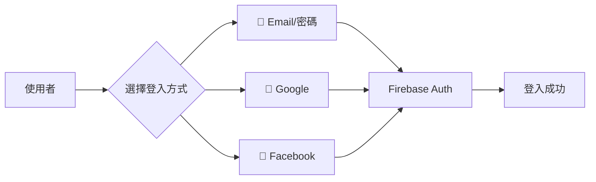
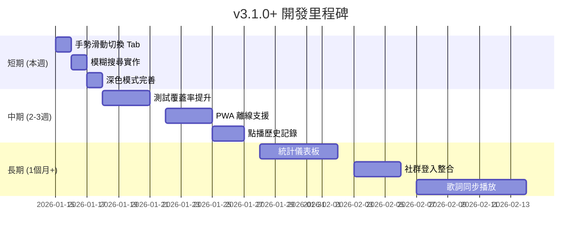

# 🚀 互動式吉他彈唱點播平台 - 未來開發詳細指南 v6

> **文件版本**: 6.0  
> **更新日期**: 2026-01-14  
> **當前版本**: v3.0.2  
> **目的**: 基於 v3.0.2 效能大優化版本完成後，提供下一階段的具體開發建議

---

## 📋 目錄

1. [已完成功能總覽](#已完成功能總覽)
2. [下一步優先項目](#下一步優先項目)
3. [中期功能擴展](#中期功能擴展)
4. [長期進階功能](#長期進階功能)
5. [技術債務清理](#技術債務清理)
6. [效能優化策略](#效能優化策略)
7. [UI/UX 優化建議](#uiux-優化建議)
8. [安全性強化](#安全性強化)

---

## ✅ 已完成功能總覽

### v3.0.x 系列 - 效能大優化版本 (2026-01-14) 🆕

| 版本 | 項目 | 狀態 | 說明 |
|------|------|------|------|
| v3.0.2 | Toast/Tooltip 修復 | ✅ 完成 | 所有訊息改為明確背景色+陰影 |
| v3.0.1 | 成功訊息綠色背景 | ✅ 完成 | success variant 加深綠色 |
| v3.0.0 | 無限循環動畫移除 | ✅ 完成 | 移除約 88 個無限循環動畫 |
| v3.0.0 | React.memo 優化 | ✅ 完成 | 5+ 個元件記憶化 |
| v3.0.0 | lazy() 延遲載入 | ✅ 完成 | 5 個元件延遲載入 |
| v3.0.0 | prefers-reduced-motion | ✅ 完成 | 全局無障礙動畫支援 |
| v3.0.0 | useReduceMotion Hook | ✅ 完成 | 統一動畫偏好檢測 |
| v3.0.0 | 虛擬滾動 | ✅ 完成 | 超過 30 首歌時啟用 |
| v3.0.0 | 搜尋防抖 | ✅ 完成 | 300ms 防抖 |

### v2.x 系列已完成項目

| 版本 | 功能 | 說明 |
|------|------|------|
| v2.5.0 | 響應式 Tab UI | 手機版 Tab 切換介面 |
| v2.5.0 | Firestore 安全強化 | 投票驗證、內容長度限制 |
| v2.4.0 | 單元測試框架 | Vitest + 33 個測試案例 |
| v2.4.0 | 程式碼分割 | React.lazy 延遲載入 |
| v2.3.0 | 搜尋功能強化 | 關鍵字搜尋所有曲庫 |
| v2.1.0 | SongList 元件拆分 | 1033 行拆分為 8 個模組 |
| v2.1.0 | 網路狀態監控 | 離線/慢速連線提示 |
| v2.1.0 | Firebase Performance | 頁面載入、API 追蹤 |

---

## 🎯 下一步優先項目

### 優先級 1：手勢滑動切換 Tab ⭐⭐⭐

**預估時間**：2-3 小時  
**目標**：手機版支援左右滑動切換 Tab

```bash
npm install @use-gesture/react
```

```typescript
// hooks/useSwipeGesture.ts
import { useDrag } from '@use-gesture/react';

export function useTabSwipe(
  currentTab: string,
  tabs: string[],
  setTab: (tab: string) => void,
  enabled: boolean = true
) {
  return useDrag(({ swipe: [swipeX] }) => {
    if (!enabled) return;
    const idx = tabs.indexOf(currentTab);
    if (swipeX < 0 && idx < tabs.length - 1) {
      setTab(tabs[idx + 1]);
    } else if (swipeX > 0 && idx > 0) {
      setTab(tabs[idx - 1]);
    }
  }, {
    axis: 'x',
    threshold: 50,
  });
}
```

**在 MobileTabView 中使用**：
```typescript
const bind = useTabSwipe(activeTab, ['songs', 'ranking'], setActiveTab);
return <div {...bind()} className="touch-none">{/* ... */}</div>;
```

---

### 優先級 2：模糊搜尋 / 拼音搜尋 ⭐⭐⭐

**預估時間**：2-3 小時  
**目標**：提升搜尋體驗，支援模糊匹配和錯字容忍

```bash
npm install fuse.js
```

```typescript
// hooks/useFuzzySearch.ts
import Fuse, { FuseResult } from 'fuse.js';
import { useMemo, useCallback } from 'react';
import type { Song } from '@/lib/firestore';

interface UseFuzzySearchOptions {
  threshold?: number;    // 0 = 完全匹配, 1 = 任意匹配
  includeScore?: boolean;
  keys?: string[];
}

export function useFuzzySearch(
  songs: Song[],
  options: UseFuzzySearchOptions = {}
) {
  const {
    threshold = 0.4,
    includeScore = true,
    keys = ['title', 'artist']
  } = options;

  const fuse = useMemo(() => new Fuse(songs, {
    keys,
    threshold,
    includeScore,
    ignoreLocation: true,      // 不限制匹配位置
    minMatchCharLength: 2,     // 最少 2 字元觸發
  }), [songs, keys, threshold, includeScore]);

  const search = useCallback((term: string): Song[] => {
    if (!term.trim()) return songs;
    return fuse.search(term).map((result: FuseResult<Song>) => result.item);
  }, [fuse, songs]);

  return { search };
}
```

**使用範例**：
```typescript
const { search } = useFuzzySearch(allSongs);
const results = search('告白起求'); // 能找到「告白氣球」
```

---

### 優先級 3：測試覆蓋率提升至 20% ⭐⭐

**預估時間**：4-5 小時  
**目前狀態**：約 5% (3 個測試檔案)

**建議新增測試優先順序**：

| 模組 | 測試類型 | 優先級 | 預估時間 |
|------|----------|--------|----------|
| `useReduceMotion.ts` | Hook 測試 | ⭐⭐⭐ | 30 分鐘 |
| `VirtualSongList.tsx` | 元件測試 | ⭐⭐⭐ | 1 小時 |
| `MobileTabView.tsx` | 元件測試 | ⭐⭐ | 1 小時 |
| `SongCard.tsx` | 元件測試 | ⭐⭐ | 1 小時 |
| `useVoting.tsx` | Hook 測試 | ⭐ | 1.5 小時 |

**useReduceMotion 測試範例**：

```typescript
// hooks/useReduceMotion.test.ts
import { renderHook, cleanup } from '@testing-library/react';
import { describe, it, expect, vi, beforeEach, afterEach } from 'vitest';
import { useReduceMotion } from './useReduceMotion';

describe('useReduceMotion', () => {
  let matchMediaMock: ReturnType<typeof vi.fn>;
  
  beforeEach(() => {
    matchMediaMock = vi.fn().mockImplementation((query: string) => ({
      matches: false,
      media: query,
      addEventListener: vi.fn(),
      removeEventListener: vi.fn(),
    }));
    window.matchMedia = matchMediaMock;
  });

  afterEach(() => {
    cleanup();
    vi.clearAllMocks();
  });

  it('應該返回 false 當用戶未設定減少動畫偏好', () => {
    const { result } = renderHook(() => useReduceMotion());
    expect(result.current).toBe(false);
  });

  it('應該返回 true 當用戶設定減少動畫偏好', () => {
    matchMediaMock.mockImplementation((query: string) => ({
      matches: query === '(prefers-reduced-motion: reduce)',
      media: query,
      addEventListener: vi.fn(),
      removeEventListener: vi.fn(),
    }));
    
    const { result } = renderHook(() => useReduceMotion());
    expect(result.current).toBe(true);
  });
});
```

---

### 優先級 4：深色模式完善 ⭐⭐

**預估時間**：3-4 小時  
**目標**：確保所有元件在深色模式下正確顯示

**待檢查元件清單**：
- [ ] Toast 訊息在深色模式下的對比度
- [ ] Tooltip 在深色模式下的可讀性
- [ ] VirtualSongList 滾動條樣式
- [ ] 搜尋欄位焦點狀態
- [ ] 骨架屏顏色調整

**實作建議**：
```css
/* index.css 增加深色模式變數 */
:root {
  --toast-bg-success: theme('colors.green.100');
  --toast-border-success: theme('colors.green.300');
}

.dark {
  --toast-bg-success: theme('colors.green.900');
  --toast-border-success: theme('colors.green.700');
}
```

---

## 🚀 中期功能擴展 (2-4 週)

### 1. PWA 離線支援

**預估時間**：5-6 小時

```bash
npm install vite-plugin-pwa -D
```

**功能清單**：
| 功能 | 說明 | 複雜度 |
|------|------|--------|
| Service Worker 緩存 | 緩存靜態資源 | 低 |
| 離線歌單檢視 | 離線時顯示已快取歌曲 | 中 |
| 安裝提示引導 | 引導使用者安裝 PWA | 低 |
| 背景同步 | 離線投票後上線自動同步 | 高 |

**vite.config.ts 配置**：
```typescript
import { VitePWA } from 'vite-plugin-pwa';

export default defineConfig({
  plugins: [
    react(),
    VitePWA({
      registerType: 'autoUpdate',
      includeAssets: ['favicon.ico', 'apple-touch-icon.png'],
      manifest: {
        name: '吉他點歌系統',
        short_name: '點歌',
        theme_color: '#f59e0b',
        background_color: '#ffffff',
        display: 'standalone',
        icons: [
          { src: '/icon-192.png', sizes: '192x192', type: 'image/png' },
          { src: '/icon-512.png', sizes: '512x512', type: 'image/png' }
        ]
      },
      workbox: {
        globPatterns: ['**/*.{js,css,html,ico,png,svg,woff2}'],
        runtimeCaching: [
          {
            urlPattern: /^https:\/\/firestore\.googleapis\.com/,
            handler: 'NetworkFirst',
            options: { cacheName: 'firestore-cache' }
          }
        ]
      }
    })
  ]
});
```

---

### 2. 統計儀表板

**預估時間**：8-10 小時

```bash
npm install recharts date-fns
```

**目錄結構**：
```
components/StatsDashboard/
├── index.tsx            (主頁面)
├── QuickStats.tsx       (快速統計卡片)
├── VoteTrendChart.tsx   (投票趨勢圖)
├── TopSongsChart.tsx    (熱門歌曲長條圖)
├── HourlyHeatmap.tsx    (活躍時段熱力圖)
└── hooks/useStats.ts    (統計資料 Hook)
```

**Firestore 資料結構**：
```typescript
// collections: stats/{date}
interface DailyStat {
  date: string;              // "2026-01-14"
  totalVotes: number;        // 當日總投票數
  uniqueVisitors: number;    // 不重複訪客
  topSongs: {
    songId: string;
    title: string;
    artist: string;
    votes: number;
  }[];
  hourlyDistribution: Record<string, number>;  // { "20": 45, "21": 62 }
}
```

**QuickStats 元件範例**：
```typescript
// components/StatsDashboard/QuickStats.tsx
interface QuickStatsProps {
  totalVotes: number;
  todayVotes: number;
  activeSongs: number;
  topSong: string;
}

export function QuickStats({ totalVotes, todayVotes, activeSongs, topSong }: QuickStatsProps) {
  return (
    <div className="grid grid-cols-2 md:grid-cols-4 gap-4">
      <StatCard title="總投票數" value={totalVotes} icon="🗳️" />
      <StatCard title="今日投票" value={todayVotes} trend="+12%" icon="📈" />
      <StatCard title="曲庫數量" value={activeSongs} icon="🎵" />
      <StatCard title="人氣冠軍" value={topSong} icon="👑" />
    </div>
  );
}
```

---

### 3. 社群登入整合

**預估時間**：3-4 小時



**實作程式碼**：
```typescript
// lib/auth.ts 擴充
import { 
  GoogleAuthProvider, 
  FacebookAuthProvider,
  signInWithPopup,
  signInWithRedirect,
  getRedirectResult
} from 'firebase/auth';
import { auth } from './firebase';

export async function signInWithGoogle() {
  const provider = new GoogleAuthProvider();
  provider.addScope('profile');
  provider.addScope('email');
  
  try {
    const result = await signInWithPopup(auth, provider);
    return { user: result.user, error: null };
  } catch (error) {
    // 手機上可能需要用 redirect
    if ((error as any).code === 'auth/popup-blocked') {
      await signInWithRedirect(auth, provider);
      const result = await getRedirectResult(auth);
      return { user: result?.user || null, error: null };
    }
    return { user: null, error: error as Error };
  }
}

export async function signInWithFacebook() {
  const provider = new FacebookAuthProvider();
  provider.addScope('public_profile');
  
  const result = await signInWithPopup(auth, provider);
  return result.user;
}
```

---

### 4. 點播歷史記錄

**預估時間**：3-4 小時

**功能需求**：
- 本機 localStorage 儲存點播記錄
- 顯示「您今日已點播 X 首」
- 查看歷史點播列表
- 快速重複點播功能

```typescript
// hooks/useVoteHistory.ts
import { useState, useEffect, useCallback } from 'react';

interface VoteRecord {
  songId: string;
  songTitle: string;
  artist: string;
  votedAt: string;  // ISO 字串
}

const STORAGE_KEY = 'vote_history';
const MAX_RECORDS = 50;

export function useVoteHistory() {
  const [history, setHistory] = useState<VoteRecord[]>([]);

  useEffect(() => {
    const stored = localStorage.getItem(STORAGE_KEY);
    if (stored) {
      setHistory(JSON.parse(stored));
    }
  }, []);

  const addRecord = useCallback((song: { id: string; title: string; artist: string }) => {
    const newRecord: VoteRecord = {
      songId: song.id,
      songTitle: song.title,
      artist: song.artist,
      votedAt: new Date().toISOString(),
    };

    setHistory(prev => {
      const updated = [newRecord, ...prev].slice(0, MAX_RECORDS);
      localStorage.setItem(STORAGE_KEY, JSON.stringify(updated));
      return updated;
    });
  }, []);

  const todayCount = history.filter(r => 
    new Date(r.votedAt).toDateString() === new Date().toDateString()
  ).length;

  return { history, addRecord, todayCount };
}
```

---

## 🌟 長期進階功能 (1-3 個月)

| 功能 | 預估時間 | 複雜度 | 說明 |
|------|----------|--------|------|
| 歌詞同步播放 | 10-15 小時 | 高 | LRC 格式、YouTube 嵌入 |
| 多語系 (i18n) | 6-8 小時 | 中 | react-i18next 整合 |
| 推播通知 (FCM) | 8-10 小時 | 高 | 歌曲進入 Top 3 通知 |
| 角色權限管理 | 6-8 小時 | 中 | guest/user/admin 權限 |
| 歌曲收藏夾 | 4-5 小時 | 中 | 使用者個人收藏 |
| 現場表演模式 | 8-10 小時 | 高 | 大螢幕投影顯示 |
| 積分勳章系統 | 12-15 小時 | 高 | 點播獲得積分、等級 |

### 歌詞同步播放設計

```
┌─────────────────────────────────────┐
│  🎵 告白氣球 - 周杰倫              │
├─────────────────────────────────────┤
│                                     │
│    塞納河畔 左岸的咖啡              │
│    我手一杯 品嚐你的美              │ ← 當前歌詞高亮
│    留下唇印 的嘴                    │
│                                     │
│  ━━━━━━━━━━━━━●━━━━━━━━━            │
│  01:23           03:45              │
│         [▶] [ ↻ ] [ ♪ ]             │
└─────────────────────────────────────┘
```

**技術考量**：
- 歌詞格式：LRC (時間軸同步)
- 儲存位置：Firestore `songs/{id}/lyrics` 子集合
- 音源：YouTube 嵌入 or 音檔上傳至 Firebase Storage

---

## 🔧 技術債務清理

### 待處理項目

| 項目 | 優先級 | 目前狀態 | 建議做法 |
|------|--------|----------|----------|
| 測試覆蓋率 | 🔴 高 | 約 5% | 目標 20% |
| Bundle 優化 | 🟡 中 | ~1 MB | Tree-shaking < 600KB |
| 移除未用依賴 | 🟢 低 | react-query 等 | `npm prune` |
| 標籤系統遷移 | 🟡 中 | 仍用 /api/tags | 改用 Firestore |
| 深色模式完善 | 🟡 中 | 部分元件不佳 | 統一 CSS 變數 |

### 已完成 ✅

- ✅ 單元測試框架 (Vitest)
- ✅ useSongSearch 測試 (11 tests)
- ✅ error-handler 測試 (22 tests)
- ✅ useVoting 測試
- ✅ 程式碼分割 (lazy loading)
- ✅ 虛擬滾動 (VirtualSongList)
- ✅ React.memo 優化
- ✅ 無限循環動畫移除
- ✅ prefers-reduced-motion 支援
- ✅ Toast/Tooltip 透明度修復

---

## 📈 效能優化策略

### 目前狀態 vs 目標

| 指標 | 目前 | 目標 | 優化方式 |
|------|------|------|----------|
| 測試覆蓋率 | ~5% | 20% | 新增 Hook/元件測試 |
| Bundle Size | ~1 MB | < 600 KB | Tree-shaking、動態載入 |
| FCP | ~1.5s | < 1.0s | 預載入、骨架屏 |
| LCP | ~2.5s | < 2.0s | 圖片懶加載 |
| 無限動畫 | 0 | 0 | ✅ 已全部移除 |
| 虛擬滾動 | ✅ | ✅ | 超過 30 首啟用 |

### Bundle 優化策略

```typescript
// vite.config.ts - 分割策略
export default defineConfig({
  build: {
    rollupOptions: {
      output: {
        manualChunks: {
          'react-vendor': ['react', 'react-dom'],
          'firebase': ['firebase/app', 'firebase/firestore', 'firebase/auth'],
          'ui-vendor': ['framer-motion', '@radix-ui/react-dialog'],
          'charts': ['recharts'],  // 未來統計儀表板
        }
      }
    }
  }
});
```

---

## 🎨 UI/UX 優化建議

### 1. SongSuggestion 元件優化

| 問題 | 建議改進 |
|------|----------|
| 歌手欄位可選填不明顯 | 加入灰色提示文字「(選填)」 |
| 送出按鈕位置 | 改為置中或靠右對齊 |
| 成功反饋不足 | 加入動畫確認效果 |
| 表單重置時機 | 送出成功後自動清空 |

### 2. LoginForm 元件優化

| 問題 | 建議改進 |
|------|----------|
| 密碼可見切換 | 加入眼睛圖示切換 |
| 錯誤訊息顯示 | 使用紅色邊框+提示文字 |
| 鍵盤導航 | 確保 Tab 順序正確 |
| 載入狀態 | 按鈕加入 spinner |

### 3. 響應式設計改進

```
桌面版 (1024px+)
┌──────────────────────────────────────────┐
│ [歌曲列表 60%] │ [排行榜 40%]            │
└──────────────────────────────────────────┘

平板 (768px-1023px)
┌──────────────────────────────────────────┐
│ [歌曲列表 100%]                          │
├──────────────────────────────────────────┤
│ [排行榜 100%]                            │
└──────────────────────────────────────────┘

手機 (< 768px)
┌────────────────────┐
│ [Tab: 歌曲/排行榜] │ ← 支援手勢滑動切換
├────────────────────┤
│ [當前Tab內容]      │
└────────────────────┘
```

---

## 🛡️ 安全性強化

### Firestore 規則進階優化

```javascript
// firestore.rules - 進階防護
rules_version = '2';
service cloud.firestore {
  match /databases/{database}/documents {
    
    // 投票速率限制：每分鐘最多 10 票
    function isRateLimited(userId) {
      let recentVotes = getAfter(
        /databases/$(database)/documents/votes
      ).data.createdAt > request.time - duration.value(1, 'm');
      return recentVotes < 10;
    }
    
    // 建議內容過濾
    match /songSuggestions/{suggestionId} {
      allow create: if request.auth != null
        && request.resource.data.title.size() >= 1
        && request.resource.data.title.size() <= 100
        && request.resource.data.artist.size() <= 50
        && (!request.resource.data.keys().hasAny(['notes']) 
            || request.resource.data.notes.size() <= 500);
    }
  }
}
```

### 待加強項目

| 項目 | 目前狀態 | 建議 |
|------|----------|------|
| Rate Limiting | 前端防連點 | 後端 API 限流 |
| 輸入驗證 | 基本驗證 | 加強 XSS 過濾 |
| HTTPS 強制 | 已啟用 | 設定 HSTS header |
| Content Security Policy | 未設定 | 加入 CSP header |

---

## 📅 建議實施時程



---

## 📋 快速開始檢查清單

### 本週可完成 (v3.1.0)

- [ ] 手勢滑動切換 Tab (2-3 小時)
- [ ] 模糊搜尋 / Fuse.js 整合 (2-3 小時)
- [ ] 深色模式 Toast/Tooltip 檢查 (1 小時)
- [ ] useReduceMotion 測試 (30 分鐘)

### 下週規劃 (v3.2.0)

- [ ] VirtualSongList 測試
- [ ] MobileTabView 測試
- [ ] 測試覆蓋率 → 15%
- [ ] PWA 基礎配置

### 月底目標

- [ ] 測試覆蓋率 → 20%
- [ ] PWA 完整支援
- [ ] 點播歷史記錄功能
- [ ] 統計儀表板基礎版

---

## 💡 快速指令

```bash
# 開發模式
npm run dev

# 測試
npm run test          # 監聽模式
npm run test:run      # 單次執行
npm run test:coverage # 覆蓋率報告

# 建置
npm run build

# 類型檢查
npm run check

# 新增依賴建議
npm install fuse.js              # 模糊搜尋
npm install @use-gesture/react   # 手勢支援
npm install vite-plugin-pwa -D   # PWA
npm install recharts             # 圖表
```

---

*最後更新：2026-01-14 v3.0.2*
*下次建議更新時機：完成 v3.1.0 後*
