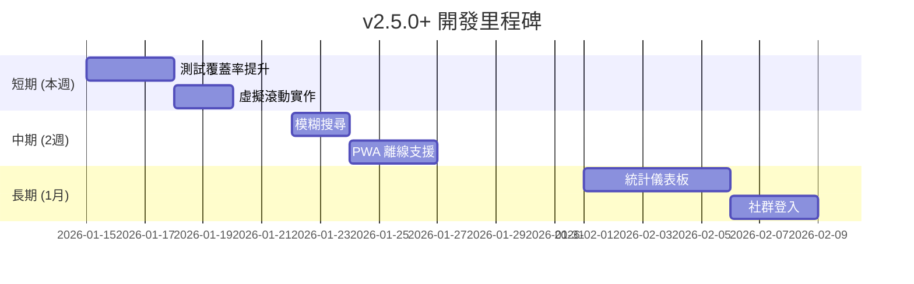

# 🚀 互動式吉他彈唱點播平台 - 未來開發詳細指南 v4

> **文件版本**: 4.0  
> **更新日期**: 2026-01-14  
> **當前版本**: v2.4.0  
> **目的**: 基於 v2.4.0 完成進度，提供下一階段的具體開發建議

---

## 📋 目錄

1. [已完成功能總覽](#已完成功能總覽)
2. [下一步優先項目](#下一步優先項目)
3. [中期功能擴展](#中期功能擴展)
4. [長期進階功能](#長期進階功能)
5. [技術債務清理](#技術債務清理)
6. [效能優化策略](#效能優化策略)
7. [部署與監控](#部署與監控)

---

## ✅ 已完成功能總覽

### v2.4.0 (2026-01-14) 🆕
| 項目 | 狀態 | 說明 |
|------|------|------|
| 單元測試基礎建設 | ✅ 完成 | Vitest 框架、33 個測試案例 |
| 程式碼分割 | ✅ 完成 | React.lazy 延遲載入 RankingBoard/SongSuggestion |
| 測試指令 | ✅ 完成 | `npm run test`, `test:run`, `test:coverage` |

### v2.3.0 (2026-01-14)
| 項目 | 狀態 | 說明 |
|------|------|------|
| 搜尋功能強化 | ✅ 完成 | 可搜尋所有曲庫內容，不限 30 首 |

### v2.1.0 ~ v2.2.0 (2026-01-12~13)
| 項目 | 狀態 | 產出檔案 |
|------|------|----------|
| SongList 元件拆分 | ✅ 完成 | 8 個獨立模組 |
| SongSuggestion 元件拆分 | ✅ 完成 | `SuggestionForm.tsx`, `SuggestionCard.tsx` |
| RankingBoard 目錄結構 | ✅ 完成 | `RankingBoard/` 目錄 |
| 網路狀態監控 | ✅ 完成 | `use-network-status.ts` |
| Firebase Performance | ✅ 完成 | `performance.ts` |
| 錯誤處理模組 | ✅ 完成 | `error-handler.ts` |
| TypeScript 嚴格模式 | ✅ 啟用 | `tsconfig.json` |

---

## 🎯 下一步優先項目

### 優先級 1：測試覆蓋率提升 ⭐⭐⭐

**目標**：從目前 2 個測試檔案擴展到 20% 覆蓋率

**建議新增測試**：

| 模組 | 優先級 | 預估時間 |
|------|--------|----------|
| `useVoting.tsx` | ⭐⭐⭐ | 2 小時 |
| `SongCard.tsx` | ⭐⭐ | 1.5 小時 |
| `firestore.ts` | ⭐⭐ | 2 小時 |
| `auth.ts` | ⭐ | 1 小時 |

**useVoting 測試範例**：

```typescript
// components/SongList/useVoting.test.ts
import { renderHook, act } from '@testing-library/react';
import { describe, it, expect, vi } from 'vitest';
import { useVoting } from './useVoting';

// Mock dependencies
vi.mock('@/lib/firestore', () => ({
  voteSong: vi.fn().mockResolvedValue(undefined),
  getSessionId: vi.fn(() => 'test-session-id'),
}));

vi.mock('@/hooks/use-toast', () => ({
  useToast: () => ({ toast: vi.fn() }),
}));

vi.mock('canvas-confetti', () => ({ default: vi.fn() }));

describe('useVoting', () => {
  it('應該初始為無投票狀態', () => {
    const { result } = renderHook(() => useVoting());
    expect(result.current.votingId).toBeNull();
    expect(result.current.clickCount).toEqual({});
  });

  it('投票後應該更新狀態', async () => {
    const { result } = renderHook(() => useVoting());
    const mockSong = { id: '1', title: '測試歌曲', artist: '測試歌手' };

    await act(async () => {
      await result.current.handleVoteStart('1', mockSong);
    });

    expect(result.current.clickCount['1']).toBe(1);
  });
});
```

---

### 優先級 2：虛擬滾動列表 ⭐⭐⭐

**目標**：優化大量歌曲的渲染效能

```bash
npm install @tanstack/react-virtual
```

**實施方式**：

```typescript
// components/SongList/VirtualizedSongList.tsx
import { useVirtualizer } from '@tanstack/react-virtual';
import { useRef } from 'react';

function VirtualizedSongList({ songs, ...props }) {
  const parentRef = useRef<HTMLDivElement>(null);
  
  const virtualizer = useVirtualizer({
    count: songs.length,
    getScrollElement: () => parentRef.current,
    estimateSize: () => 120,
    overscan: 5,
  });

  return (
    <div ref={parentRef} className="h-[500px] overflow-auto">
      <div style={{ height: `${virtualizer.getTotalSize()}px`, position: 'relative' }}>
        {virtualizer.getVirtualItems().map((virtualRow) => (
          <div
            key={virtualRow.key}
            style={{
              position: 'absolute',
              top: 0,
              left: 0,
              width: '100%',
              transform: `translateY(${virtualRow.start}px)`,
            }}
          >
            <SongCard song={songs[virtualRow.index]} {...props} />
          </div>
        ))}
      </div>
    </div>
  );
}
```

---

### 優先級 3：模糊搜尋 / 拼音搜尋 ⭐⭐

**目標**：支援容錯搜尋，提升使用者體驗

```bash
npm install fuse.js
```

**實施方式**：

```typescript
// hooks/useFuzzySearch.ts
import Fuse from 'fuse.js';
import { useMemo, useCallback } from 'react';
import type { Song } from '@/lib/firestore';

export function useFuzzySearch(songs: Song[]) {
  const fuse = useMemo(() => new Fuse(songs, {
    keys: ['title', 'artist'],
    threshold: 0.4,
    distance: 100,
    includeScore: true,
  }), [songs]);

  const search = useCallback((term: string) => {
    if (!term.trim()) return songs;
    return fuse.search(term).map(result => result.item);
  }, [fuse, songs]);

  return { search };
}
```

---

### 優先級 4：搜尋結果分頁 ⭐⭐

**目標**：當搜尋結果過多時分頁顯示

```typescript
// 在 useSongSearch.ts 中新增
const SEARCH_PAGE_SIZE = 50;

const paginatedResults = useMemo(() => {
  if (!searchResults) return null;
  const start = (searchPage - 1) * SEARCH_PAGE_SIZE;
  return searchResults.slice(start, start + SEARCH_PAGE_SIZE);
}, [searchResults, searchPage]);
```

---

## 🚀 中期功能擴展 (2-4 週)

### 1. PWA 離線支援

**預估時間**：5-6 小時

```bash
npm install vite-plugin-pwa -D
```

```typescript
// vite.config.ts
import { VitePWA } from 'vite-plugin-pwa';

export default defineConfig({
  plugins: [
    VitePWA({
      registerType: 'autoUpdate',
      manifest: {
        name: '吉他點歌平台',
        short_name: '點歌',
        theme_color: '#f59e0b',
        icons: [
          { src: 'pwa-192x192.png', sizes: '192x192', type: 'image/png' },
          { src: 'pwa-512x512.png', sizes: '512x512', type: 'image/png' }
        ]
      },
      workbox: {
        globPatterns: ['**/*.{js,css,html,ico,png,svg}'],
        runtimeCaching: [{
          urlPattern: /^https:\/\/firestore\.googleapis\.com\/.*/i,
          handler: 'NetworkFirst',
          options: { cacheName: 'firestore-cache' }
        }]
      }
    })
  ]
});
```

---

### 2. 統計儀表板

**預估時間**：8-10 小時

**建議結構**：

```
components/StatsDashboard/
├── index.tsx            (主頁面)
├── QuickStats.tsx       (快速統計卡片)
├── TrendChart.tsx       (趨勢圖)
├── TopSongsChart.tsx    (熱門歌曲)
└── hooks/useStats.ts    (統計 Hook)
```

**視覺化設計**：

```
┌─────────────────────────────────────────────────┐
│  📊 今日統計                                      │
├────────────┬────────────┬────────────┬──────────┤
│  🎵 156    │  👥 89     │  🔥 告白氣球│  ⏰ 21:00│
│  總點播數   │  獨立訪客   │  熱門歌曲   │  尖峰時段 │
└────────────┴────────────┴────────────┴──────────┘
```

---

### 3. 社群登入

**預估時間**：3-4 小時

```typescript
// lib/auth.ts 擴充
import { GoogleAuthProvider, signInWithPopup } from 'firebase/auth';

export async function signInWithGoogle() {
  const provider = new GoogleAuthProvider();
  return signInWithPopup(auth, provider);
}
```

---

## 🌟 長期進階功能 (1-3 個月)

| 功能 | 預估時間 | 複雜度 |
|------|----------|--------|
| 歌詞同步播放 | 10-15 小時 | 高 |
| 多語系 (i18n) | 6-8 小時 | 中 |
| 推播通知 (FCM) | 8-10 小時 | 高 |
| 角色權限管理 | 6-8 小時 | 中 |
| 歌曲收藏夾 | 4-5 小時 | 中 |

---

## 🔧 技術債務清理

### 待處理項目

| 項目 | 優先級 | 狀態 |
|------|--------|------|
| 測試覆蓋率 20% | 🔴 高 | 目前約 5% |
| Bundle 優化 < 600KB | 🟡 中 | 待實施 Tree-shaking |
| 移除未用 react-query | � 低 | 待清理 |

### 已完成 ✅

- ✅ 單元測試框架 (Vitest)
- ✅ useSongSearch 測試 (11 tests)
- ✅ error-handler 測試 (22 tests)
- ✅ 程式碼分割 (lazy loading)
- ✅ 搜尋功能強化
- ✅ SongList/SongSuggestion 元件拆分
- ✅ TypeScript 嚴格模式
- ✅ 錯誤處理模組
- ✅ 網路狀態監控

---

## 📈 效能優化策略

### 目前效能指標

| 指標 | 目前 | 目標 |
|------|------|------|
| 測試覆蓋率 | ~5% | 20% |
| Bundle Size | ~1 MB | < 600 KB |
| 初始載入時間 | - | < 2s |

### 優化方向

1. **Tree-shaking**：移除未使用的程式碼
2. **圖片優化**：WebP 格式、懶加載
3. **Firestore 查詢**：使用 limit()、cursor pagination

---

## 🚢 部署與監控

### GitHub Actions CI

```yaml
# .github/workflows/ci.yml
name: CI
on: [push, pull_request]

jobs:
  test:
    runs-on: ubuntu-latest
    steps:
      - uses: actions/checkout@v4
      - uses: actions/setup-node@v4
        with: { node-version: '20', cache: 'npm' }
      - run: npm ci
      - run: npm run check
      - run: npm run test:run
      - run: npm run build
```

---

## 📅 建議實施時程



---

## 📋 快速開始檢查清單

### 本週可完成 (v2.5.0)

- [ ] 新增 useVoting 測試
- [ ] 新增 SongCard 測試
- [ ] 測試覆蓋率 → 20%
- [ ] 虛擬滾動列表

### 下週規劃

- [ ] 模糊搜尋 / 拼音搜尋
- [ ] 搜尋結果分頁
- [ ] PWA 基礎配置

---

*最後更新：2026-01-14 v2.4.0*
