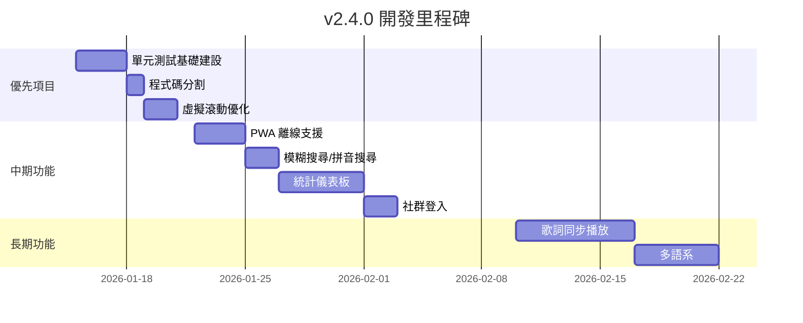

# 🚀 互動式吉他彈唱點播平台 - 未來開發詳細指南 v3

> **文件版本**: 3.0  
> **更新日期**: 2026-01-14  
> **當前版本**: v2.3.0  
> **目的**: 基於 v2.3.0 完成進度，提供下一階段的具體開發建議

---

## 📋 目錄

1. [已完成功能總覽](#已完成功能總覽)
2. [下一步優先項目](#下一步優先項目)
3. [中期功能擴展](#中期功能擴展)
4. [長期進階功能](#長期進階功能)
5. [技術債務清理](#技術債務清理)
6. [UI/UX 優化建議](#uiux-優化建議)
7. [效能優化策略](#效能優化策略)
8. [部署與監控](#部署與監控)

---

## ✅ 已完成功能總覽

### v2.3.0 (2026-01-14)
| 項目 | 狀態 | 說明 |
|------|------|------|
| 搜尋功能強化 | ✅ 完成 | 關鍵字搜尋可搜尋所有曲庫內容，不再限制於前 30 首 |

### v2.1.0 ~ v2.2.0 (2026-01-12~13)
| 項目 | 狀態 | 產出檔案 |
|------|------|----------|
| SongList 元件拆分 | ✅ 完成 | 8 個獨立模組 |
| 網路狀態監控 | ✅ 完成 | `use-network-status.ts`, `NetworkStatusBanner.tsx` |
| Firebase Performance | ✅ 完成 | `performance.ts` |
| TypeScript 嚴格模式 | ✅ 已啟用 | `tsconfig.json` |
| 標籤系統遷移 | ✅ 已完成 | `use-tags.ts` |
| 錯誤處理模組 | ✅ 已完成 | `error-handler.ts` |
| RankingBoard 元件拆分 | ✅ 部分完成 | 已建立 `RankingBoard/` 目錄結構 |
| SongSuggestion 元件拆分 | ✅ 完成 | `SuggestionForm.tsx`, `SuggestionCard.tsx` |

---

## 🎯 下一步優先項目

### 優先級 1：單元測試基礎建設 ⭐⭐⭐

**預估時間**：4-6 小時  
**目標**：建立測試框架並達到 20% 覆蓋率

**安裝依賴**：

```bash
npm install -D vitest @testing-library/react @testing-library/jest-dom jsdom @testing-library/user-event
```

**配置 vitest**：

```typescript
// vite.config.ts 新增
export default defineConfig({
  test: {
    globals: true,
    environment: 'jsdom',
    setupFiles: './src/test/setup.ts',
    coverage: {
      provider: 'v8',
      reporter: ['text', 'json', 'html'],
    },
  },
});
```

**優先測試的模組**：

| 模組 | 優先級 | 原因 |
|------|--------|------|
| `useSongSearch` | ⭐⭐⭐ | 純邏輯 Hook，剛完成搜尋強化 |
| `useVoting` | ⭐⭐⭐ | 核心功能 |
| `error-handler` | ⭐⭐ | 工具函式 |
| `SongCard` | ⭐⭐ | UI 元件 |

**範例測試 (useSongSearch)**：

```typescript
// components/SongList/useSongSearch.test.ts
import { renderHook, act } from '@testing-library/react';
import { describe, it, expect } from 'vitest';
import { useSongSearch } from './useSongSearch';

const mockSongs = [
  { id: '1', title: '告白氣球', artist: '周杰倫', voteCount: 10 },
  { id: '2', title: '稻香', artist: '周杰倫', voteCount: 8 },
  { id: '3', title: '小幸運', artist: '田馥甄', voteCount: 5 },
];

describe('useSongSearch', () => {
  it('should filter songs by title', async () => {
    const { result } = renderHook(() => useSongSearch(mockSongs));
    
    act(() => {
      result.current.setSearchTerm('告白');
    });
    
    // 等待 debounce
    await new Promise(r => setTimeout(r, 350));
    
    expect(result.current.filteredSongs).toHaveLength(1);
    expect(result.current.filteredSongs[0].title).toBe('告白氣球');
  });

  it('should search in all songs when allSongs is provided', async () => {
    const allSongs = [...mockSongs, 
      { id: '4', title: '稀客', artist: '各種情歌', voteCount: 3 }
    ];
    const { result } = renderHook(() => useSongSearch(allSongs));
    
    act(() => {
      result.current.setSearchTerm('稀客');
    });
    
    await new Promise(r => setTimeout(r, 350));
    
    expect(result.current.filteredSongs).toHaveLength(1);
  });
});
```

---

### 優先級 2：程式碼分割 (Code Splitting) ⭐⭐⭐

**預估時間**：2 小時  
**目標**：減少初始 Bundle 大小

**實施方式**：

```typescript
// App.tsx 或 Home.tsx
import { lazy, Suspense } from 'react';
import { Skeleton } from '@/components/ui/skeleton';

// 延遲載入大型元件
const RankingBoard = lazy(() => import('@/components/RankingBoard'));
const SongSuggestion = lazy(() => import('@/components/SongSuggestion'));
const MusicPlayer = lazy(() => import('@/components/MusicPlayer'));

function LoadingFallback() {
  return (
    <div className="p-4 space-y-3">
      <Skeleton className="h-8 w-full" />
      <Skeleton className="h-32 w-full" />
      <Skeleton className="h-8 w-3/4" />
    </div>
  );
}

// 使用
<Suspense fallback={<LoadingFallback />}>
  <RankingBoard songs={songs} />
</Suspense>
```

---

### 優先級 3：無限滾動優化 ⭐⭐

**預估時間**：2-3 小時  
**目標**：提升大量歌曲的瀏覽體驗

現在搜尋可搜尋所有曲庫，但顯示大量結果時可能影響效能。

**實施方式**：

```bash
npm install @tanstack/react-virtual
```

```typescript
// components/SongList/VirtualizedSongList.tsx
import { useVirtualizer } from '@tanstack/react-virtual';

function VirtualizedSongList({ songs, ...props }) {
  const parentRef = useRef<HTMLDivElement>(null);
  
  const virtualizer = useVirtualizer({
    count: songs.length,
    getScrollElement: () => parentRef.current,
    estimateSize: () => 120, // 預估每個歌曲卡片高度
    overscan: 5,
  });

  return (
    <div ref={parentRef} className="h-[500px] overflow-auto">
      <div
        style={{ height: `${virtualizer.getTotalSize()}px`, position: 'relative' }}
      >
        {virtualizer.getVirtualItems().map((virtualRow) => (
          <div
            key={virtualRow.key}
            style={{
              position: 'absolute',
              top: 0,
              left: 0,
              width: '100%',
              transform: `translateY(${virtualRow.start}px)`,
            }}
          >
            <SongCard song={songs[virtualRow.index]} {...props} />
          </div>
        ))}
      </div>
    </div>
  );
}
```

---

### 優先級 4：搜尋結果分頁 ⭐⭐

**目標**：當搜尋結果過多時，提供分頁顯示

```typescript
// components/SongList/useSongSearch.ts 增強
const SEARCH_PAGE_SIZE = 50;

export function useSongSearch(songs: Song[]) {
  const [searchPage, setSearchPage] = useState(1);
  
  // ... 現有邏輯 ...
  
  const paginatedResults = useMemo(() => {
    if (!searchResults) return null;
    const start = (searchPage - 1) * SEARCH_PAGE_SIZE;
    return searchResults.slice(start, start + SEARCH_PAGE_SIZE);
  }, [searchResults, searchPage]);
  
  const totalSearchPages = searchResults 
    ? Math.ceil(searchResults.length / SEARCH_PAGE_SIZE) 
    : 0;

  return {
    // ... 現有回傳值 ...
    paginatedResults,
    searchPage,
    setSearchPage,
    totalSearchPages,
    totalSearchResults: searchResults?.length ?? 0,
  };
}
```

---

## 🚀 中期功能擴展 (2-4 週)

### 1. PWA 離線支援

**預估時間**：5-6 小時

**安裝**：
```bash
npm install vite-plugin-pwa -D
```

**配置重點**：

```typescript
// vite.config.ts
import { VitePWA } from 'vite-plugin-pwa';

export default defineConfig({
  plugins: [
    VitePWA({
      registerType: 'autoUpdate',
      manifest: {
        name: '吉他點歌平台',
        short_name: '點歌',
        theme_color: '#f59e0b',
        background_color: '#ffffff',
        display: 'standalone',
        icons: [
          { src: 'pwa-192x192.png', sizes: '192x192', type: 'image/png' },
          { src: 'pwa-512x512.png', sizes: '512x512', type: 'image/png' }
        ]
      },
      workbox: {
        globPatterns: ['**/*.{js,css,html,ico,png,svg}'],
        runtimeCaching: [
          {
            urlPattern: /^https:\/\/firestore\.googleapis\.com\/.*/i,
            handler: 'NetworkFirst',
            options: { cacheName: 'firestore-cache' }
          }
        ]
      }
    })
  ]
});
```

**離線功能實施**：

| 功能 | 說明 | 優先級 |
|------|------|--------|
| Service Worker | 緩存靜態資源 | ⭐⭐⭐ |
| 離線歌單檢視 | 離線時顯示已快取的歌曲 | ⭐⭐⭐ |
| 安裝提示 | 引導使用者安裝 PWA | ⭐⭐ |
| 背景同步 | 離線投票後上線自動同步 | ⭐ |

---

### 2. 統計儀表板

**預估時間**：8-10 小時

**建議結構**：

```
components/StatsDashboard/
├── index.tsx            (主頁面)
├── QuickStats.tsx       (快速統計卡片)
├── TrendChart.tsx       (趨勢圖 - 使用 recharts)
├── TopSongsChart.tsx    (熱門歌曲)
├── HourlyHeatmap.tsx    (時段熱力圖)
└── hooks/
    └── useStats.ts      (統計 Hook)
```

**Firestore 資料結構**：

```typescript
// stats/{date}
interface DailyStat {
  date: string;           // "2026-01-14"
  totalVotes: number;
  uniqueVisitors: number;
  hourly: Record<string, number>;  // { "20": 45, "21": 62 }
  songs: Record<string, number>;   // { songId: voteCount }
}
```

**視覺化圖表**：

```
┌─────────────────────────────────────────────────────────────┐
│  📊 今日統計                                                  │
├──────────────┬──────────────┬──────────────┬────────────────┤
│  🎵 總點播數   │  👥 獨立訪客   │  🔥 熱門歌曲   │  ⏰ 尖峰時段    │
│     156      │      89      │   告白氣球    │    21:00     │
└──────────────┴──────────────┴──────────────┴────────────────┘
│                                                              │
│  📈 近7天趨勢                                                 │
│  ┌─────────────────────────────────────────────────────────┐ │
│  │     *                                                   │ │
│  │   *   *                                     *           │ │
│  │ *       *   *                             *   *         │ │
│  │           *   *                         *       *       │ │
│  │               *   *   *   *   *   *   *                 │ │
│  └─────────────────────────────────────────────────────────┘ │
│    Mon   Tue   Wed   Thu   Fri   Sat   Sun                   │
└──────────────────────────────────────────────────────────────┘
```

---

### 3. 社群登入 (Google/Facebook)

**預估時間**：3-4 小時

**實施步驟**：

1. Firebase Console 啟用 Google/Facebook 登入
2. 擴充 `auth.ts`：

```typescript
// lib/auth.ts
import { 
  GoogleAuthProvider, 
  FacebookAuthProvider,
  signInWithPopup 
} from 'firebase/auth';

export async function signInWithGoogle() {
  const provider = new GoogleAuthProvider();
  return signInWithPopup(auth, provider);
}

export async function signInWithFacebook() {
  const provider = new FacebookAuthProvider();
  return signInWithPopup(auth, provider);
}
```

3. 更新 `LoginForm.tsx` 新增社群登入按鈕

```typescript
// 按鈕範例
<Button 
  onClick={signInWithGoogle}
  className="w-full bg-white border-2 border-gray-200 text-gray-700 hover:bg-gray-50"
>
  <GoogleIcon className="w-5 h-5 mr-2" />
  使用 Google 登入
</Button>
```

---

### 4. 搜尋功能進階 (模糊搜尋 & 拼音)

**預估時間**：3-4 小時

**目標**：支援拼音搜尋、模糊匹配

```bash
npm install fuse.js
```

```typescript
// hooks/useFuzzySearch.ts
import Fuse from 'fuse.js';

export function useFuzzySearch(songs: Song[]) {
  const fuse = useMemo(() => new Fuse(songs, {
    keys: ['title', 'artist'],
    threshold: 0.4,       // 模糊程度 (0 = 精確, 1 = 完全模糊)
    distance: 100,
    includeScore: true,
  }), [songs]);

  const search = useCallback((term: string) => {
    if (!term.trim()) return songs;
    return fuse.search(term).map(result => result.item);
  }, [fuse, songs]);

  return { search };
}
```

---

## 🌟 長期進階功能 (1-3 個月)

| 功能 | 預估時間 | 複雜度 | 描述 |
|------|----------|--------|------|
| 歌詞同步播放 | 10-15 小時 | 高 | LRC 格式解析、同步播放 |
| 多語系 (i18n) | 6-8 小時 | 中 | react-i18next 整合 |
| 推播通知 | 8-10 小時 | 高 | Firebase Cloud Messaging |
| 權限管理 | 6-8 小時 | 中 | 角色分層 (guest/user/admin) |
| A/B 測試 | 4-5 小時 | 中 | 實驗框架建設 |
| 歌曲收藏夾 | 4-5 小時 | 中 | 使用者個人收藏功能 |
| 播放歷史 | 3-4 小時 | 低 | 記錄使用者點播歷史 |

### 歌詞同步播放功能詳細規劃

```
┌─────────────────────────────────────┐
│  🎵 告白氣球 - 周杰倫              │
├─────────────────────────────────────┤
│                                     │
│    塞納河畔 左岸的咖啡              │
│    我手一杯 品嚐你的美              │ ← 當前歌詞高亮
│    留下唇印 的嘴                    │
│                                     │
│  ━━━━━━━━━━━━━●━━━━━━━━━            │
│  01:23           03:45              │
│         [▶] [ ↻ ] [ ♪ ]             │
└─────────────────────────────────────┘
```

**技術考量**：
- 歌詞格式：LRC (時間軸同步)
- 儲存位置：Firestore `songs/{id}/lyrics`
- 音源：YouTube 嵌入 or 音檔上傳

---

## 🔧 技術債務清理

### 待處理項目

| 項目 | 優先級 | 說明 | 預估時間 |
|------|--------|------|----------|
| 單元測試覆蓋率 | 🔴 高 | 目前 0%，目標 20% | 4-6 小時 |
| Bundle 大小優化 | 🟡 中 | 目前約 1MB，目標 < 600KB | 2-3 小時 |
| 移除未使用的 react-query 呼叫 | 🟡 中 | 部分元件仍有殘留 | 1 小時 |
| CSS 模組化 | 🟢 低 | Tailwind 整理 | 2 小時 |
| 元件文件化 | 🟢 低 | JSDoc 或 Storybook | 4 小時 |

### 已完成項目 ✅

- ✅ 搜尋功能強化（v2.3.0 - 可搜尋所有曲庫）
- ✅ SongList 元件拆分 (1033 行 → 8 模組)
- ✅ SongSuggestion 元件拆分
- ✅ RankingBoard 目錄結構建立
- ✅ TypeScript 嚴格模式
- ✅ 標籤系統 Firestore 遷移
- ✅ 錯誤處理模組
- ✅ 網路狀態監控
- ✅ Firebase Performance

---

## 🎨 UI/UX 優化建議

### 響應式設計改善

```
桌面版 (1024px+)
┌──────────────────────────────────────────┐
│ [歌曲列表 50%] │ [排行榜 50%]            │
└──────────────────────────────────────────┘

平板 (768px-1023px)
┌──────────────────────────────────────────┐
│ [歌曲列表 100%]                          │
├──────────────────────────────────────────┤
│ [排行榜 100%]                            │
└──────────────────────────────────────────┘

手機 (< 768px)
┌────────────────────┐
│ [Tab: 歌曲/排行榜] │
├────────────────────┤
│ [當前Tab內容]      │
└────────────────────┘
```

### 無障礙功能 (a11y)

- [ ] 所有互動元素加入 `aria-label`
- [ ] 支援鍵盤導航 (Tab, Enter, Escape)
- [ ] 高對比模式支援
- [ ] 螢幕閱讀器相容

### 動畫效能優化

- [ ] 在低階設備上自動減少動畫
- [ ] 使用 `will-change` 優化動畫效能
- [ ] 統一動畫時間曲線 (目前使用 Framer Motion)

---

## 📈 效能優化策略

### 建議指標目標

| 指標 | 目前預估 | 目標 | 優化方式 |
|------|----------|------|----------|
| FCP (First Contentful Paint) | ~1.5s | < 1.0s | 預載入、程式碼分割 |
| LCP (Largest Contentful Paint) | ~2.5s | < 2.0s | 圖片懶加載 |
| CLS (Cumulative Layout Shift) | ~0.1 | < 0.1 | 骨架屏 |
| Bundle Size | ~1 MB | < 600 KB | Tree-shaking, Code Splitting |

### 搜尋效能優化

現在搜尋會處理所有曲庫，對於大量歌曲可能需要：

1. **Web Worker 背景搜尋**
```typescript
// workers/searchWorker.ts
self.onmessage = (e: MessageEvent) => {
  const { songs, term } = e.data;
  const results = songs.filter(/* ... */);
  self.postMessage(results);
};
```

2. **搜尋結果快取**
```typescript
const searchCache = new Map<string, Song[]>();

function getCachedSearch(term: string, songs: Song[]) {
  const cacheKey = `${term}_${songs.length}`;
  if (searchCache.has(cacheKey)) return searchCache.get(cacheKey);
  // ... 執行搜尋 ...
}
```

---

## 🚢 部署與監控

### GitHub Actions CI 增強

```yaml
# .github/workflows/ci.yml
name: CI

on:
  push:
    branches: [main, develop]
  pull_request:
    branches: [main]

jobs:
  test:
    runs-on: ubuntu-latest
    steps:
      - uses: actions/checkout@v4
      - uses: actions/setup-node@v4
        with:
          node-version: '20'
          cache: 'npm'
      - run: npm ci
      - run: npm run check     # TypeScript
      - run: npm run test      # 單元測試
      - run: npm run build     # 建置驗證
```

### 監控儀表板

| 工具 | 用途 | 成本 |
|------|------|------|
| Firebase Analytics | 使用者行為 | 免費 |
| Firebase Performance | 效能指標 | 免費 |
| Sentry | 錯誤追蹤 | 免費方案可用 |
| Uptime Robot | 可用性監控 | 免費 |

---

## 📅 建議實施時程



---

## 📋 快速開始檢查清單

### 本週可完成 (v2.4.0)

- [ ] 安裝 vitest 並寫第一個測試 (`useSongSearch`)
- [ ] 實施程式碼分割 (lazy loading)
- [ ] 為搜尋結果加入結果數量限制/分頁

### 下週規劃

- [ ] 測試覆蓋率提升至 20%
- [ ] 虛擬滾動列表實作
- [ ] PWA 基礎配置

### 兩週內

- [ ] 模糊搜尋/拼音搜尋
- [ ] 統計儀表板基礎建設

---

## 🔗 相關資源

- [Vitest 文件](https://vitest.dev/)
- [React Testing Library](https://testing-library.com/docs/react-testing-library/intro/)
- [TanStack Virtual](https://tanstack.com/virtual/latest)
- [Fuse.js (模糊搜尋)](https://fusejs.io/)
- [Vite PWA Plugin](https://vite-pwa-org.netlify.app/)
- [Firebase Performance](https://firebase.google.com/docs/perf-mon)

---

*此文件將隨專案進展持續更新*  
*最後更新：2026-01-14 v2.3.0*
