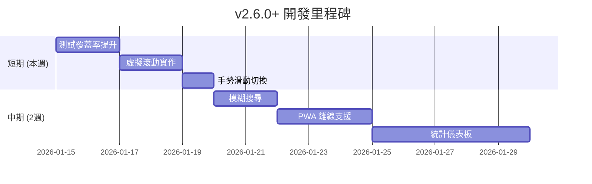

# 🚀 互動式吉他彈唱點播平台 - 未來開發詳細指南 v5

> **文件版本**: 5.0  
> **更新日期**: 2026-01-14  
> **當前版本**: v2.5.0  
> **目的**: 基於 v2.5.0 完成進度，提供下一階段的具體開發建議

---

## 📋 目錄

1. [已完成功能總覽](#已完成功能總覽)
2. [下一步優先項目](#下一步優先項目)
3. [中期功能擴展](#中期功能擴展)
4. [長期進階功能](#長期進階功能)
5. [技術債務清理](#技術債務清理)
6. [效能優化策略](#效能優化策略)

---

## ✅ 已完成功能總覽

### v2.5.0 (2026-01-14) 🆕
| 項目 | 狀態 | 說明 |
|------|------|------|
| 響應式 Tab UI | ✅ 完成 | 手機版 Tab 切換介面（歌曲/排行榜）|
| Tab UI/UX 優化 | ✅ 完成 | 提示文字、動畫、位置指示器、Sticky |
| Firestore 安全強化 | ✅ 完成 | 投票驗證、建議內容長度限制 |
| 安全規則部署 | ✅ 完成 | 已部署至 `guitar-ff931` |

### v2.4.0 (2026-01-14)
| 項目 | 狀態 | 說明 |
|------|------|------|
| 單元測試框架 | ✅ 完成 | Vitest 整合、33 個測試案例 |
| 程式碼分割 | ✅ 完成 | React.lazy 延遲載入 |
| 測試指令 | ✅ 完成 | `npm run test`, `test:run`, `test:coverage` |

### v2.3.0 (2026-01-14)
| 項目 | 狀態 | 說明 |
|------|------|------|
| 搜尋功能強化 | ✅ 完成 | 可搜尋所有曲庫內容 |

### v2.1.0 ~ v2.2.0 (2026-01-12~13)
- ✅ SongList/SongSuggestion 元件拆分
- ✅ RankingBoard 目錄結構
- ✅ 網路狀態監控
- ✅ Firebase Performance
- ✅ 錯誤處理模組
- ✅ TypeScript 嚴格模式

---

## 🎯 下一步優先項目

### 優先級 1：測試覆蓋率提升至 20% ⭐⭐⭐

**預估時間**：4 小時

**建議新增測試**：

| 模組 | 優先級 | 說明 |
|------|--------|------|
| `useVoting.tsx` | ⭐⭐⭐ | 核心投票邏輯 |
| `MobileTabView.tsx` | ⭐⭐ | 新增的 Tab 元件 |
| `SongCard.tsx` | ⭐⭐ | UI 元件測試 |

**useVoting 測試範例**：

```typescript
// components/SongList/useVoting.test.ts
import { renderHook, act } from '@testing-library/react';
import { describe, it, expect, vi } from 'vitest';

vi.mock('@/lib/firestore', () => ({
  voteSong: vi.fn().mockResolvedValue(undefined),
  getSessionId: vi.fn(() => 'test-session'),
}));

vi.mock('@/hooks/use-toast', () => ({
  useToast: () => ({ toast: vi.fn() }),
}));

vi.mock('canvas-confetti', () => ({ default: vi.fn() }));

describe('useVoting', () => {
  it('應該初始為無投票狀態', () => {
    const { result } = renderHook(() => useVoting());
    expect(result.current.votingId).toBeNull();
  });
});
```

---

### 優先級 2：虛擬滾動列表 ⭐⭐⭐

**預估時間**：3 小時  
**目標**：優化大量歌曲的渲染效能

```bash
npm install @tanstack/react-virtual
```

```typescript
// components/SongList/VirtualizedSongList.tsx
import { useVirtualizer } from '@tanstack/react-virtual';

function VirtualizedSongList({ songs, ...props }) {
  const parentRef = useRef<HTMLDivElement>(null);
  
  const virtualizer = useVirtualizer({
    count: songs.length,
    getScrollElement: () => parentRef.current,
    estimateSize: () => 120,
    overscan: 5,
  });

  return (
    <div ref={parentRef} className="h-[500px] overflow-auto">
      <div style={{ height: virtualizer.getTotalSize() }}>
        {virtualizer.getVirtualItems().map((row) => (
          <SongCard key={row.key} song={songs[row.index]} {...props} />
        ))}
      </div>
    </div>
  );
}
```

---

### 優先級 3：手勢滑動切換 Tab ⭐⭐

**預估時間**：2 小時  
**目標**：手機版支援左右滑動切換 Tab

```bash
npm install @use-gesture/react
```

```typescript
// hooks/useSwipeGesture.ts
import { useSwipeable } from 'react-swipeable';

export function useTabSwipe(
  currentTab: string,
  tabs: string[],
  setTab: (tab: string) => void
) {
  return useSwipeable({
    onSwipedLeft: () => {
      const idx = tabs.indexOf(currentTab);
      if (idx < tabs.length - 1) setTab(tabs[idx + 1]);
    },
    onSwipedRight: () => {
      const idx = tabs.indexOf(currentTab);
      if (idx > 0) setTab(tabs[idx - 1]);
    },
    trackMouse: false,
  });
}
```

---

### 優先級 4：模糊搜尋 / 拼音搜尋 ⭐⭐

**預估時間**：2 小時

```bash
npm install fuse.js
```

```typescript
// hooks/useFuzzySearch.ts
import Fuse from 'fuse.js';

export function useFuzzySearch(songs: Song[]) {
  const fuse = useMemo(() => new Fuse(songs, {
    keys: ['title', 'artist'],
    threshold: 0.4,
    includeScore: true,
  }), [songs]);

  return { search: (term: string) => fuse.search(term).map(r => r.item) };
}
```

---

## 🚀 中期功能擴展 (2-4 週)

### 1. PWA 離線支援

**預估時間**：5-6 小時

```bash
npm install vite-plugin-pwa -D
```

**功能清單**：
- [ ] Service Worker 緩存靜態資源
- [ ] 離線歌單檢視
- [ ] 安裝提示引導
- [ ] 背景同步（離線投票）

---

### 2. 統計儀表板

**預估時間**：8-10 小時

```
components/StatsDashboard/
├── index.tsx            (主頁面)
├── QuickStats.tsx       (快速統計卡片)
├── TrendChart.tsx       (趨勢圖)
├── TopSongsChart.tsx    (熱門歌曲)
└── hooks/useStats.ts    (統計 Hook)
```

**Firestore 結構**：
```typescript
// stats/{date}
interface DailyStat {
  date: string;           // "2026-01-14"
  totalVotes: number;
  uniqueVisitors: number;
  hourly: Record<string, number>;
}
```

---

### 3. 社群登入

**預估時間**：3-4 小時

- [ ] Google 登入
- [ ] Facebook 登入
- [ ] LINE 登入（可選）

---

### 4. 點播歷史記錄

**預估時間**：3 小時

- [ ] 使用者點播歷史
- [ ] 最近播放列表
- [ ] 收藏歌曲功能

---

## 🌟 長期進階功能 (1-3 個月)

| 功能 | 預估時間 | 複雜度 |
|------|----------|--------|
| 歌詞同步播放 | 10-15 小時 | 高 |
| 多語系 (i18n) | 6-8 小時 | 中 |
| 推播通知 (FCM) | 8-10 小時 | 高 |
| 角色權限管理 | 6-8 小時 | 中 |
| 歌曲收藏夾 | 4-5 小時 | 中 |
| 現場表演模式 | 8-10 小時 | 高 |

---

## 🔧 技術債務清理

### 待處理項目

| 項目 | 優先級 | 狀態 |
|------|--------|------|
| 測試覆蓋率 20% | 🔴 高 | 目前約 5% |
| Bundle 優化 < 600KB | 🟡 中 | 待 Tree-shaking |
| 移除未用依賴 | 🟢 低 | react-query 等 |

### 已完成 ✅

- ✅ 單元測試框架 (Vitest)
- ✅ useSongSearch 測試 (11 tests)  
- ✅ error-handler 測試 (22 tests)
- ✅ 程式碼分割 (lazy loading)
- ✅ 搜尋功能強化
- ✅ 響應式 Tab UI
- ✅ Tab UI/UX 優化
- ✅ Firestore 安全規則強化
- ✅ SongList/SongSuggestion 拆分
- ✅ TypeScript 嚴格模式
- ✅ 錯誤處理模組
- ✅ 網路狀態監控

---

## 📈 效能優化策略

### 目前狀態

| 指標 | 目前 | 目標 |
|------|------|------|
| 測試覆蓋率 | ~5% | 20% |
| Bundle Size | ~1 MB | < 600 KB |
| 手機版 UX | ✅ 優化 | - |

### 優化方向

1. **Tree-shaking**：移除未使用的程式碼
2. **虛擬滾動**：大量列表渲染優化
3. **圖片優化**：WebP 格式、懶加載
4. **Firestore 查詢**：分頁載入、cursor pagination

---

## 📅 建議實施時程



---

## 📋 快速開始檢查清單

### 本週可完成 (v2.6.0)

- [ ] 新增 useVoting 測試
- [ ] 新增 MobileTabView 測試
- [ ] 虛擬滾動列表
- [ ] 手勢滑動切換 Tab

### 下週規劃

- [ ] 模糊搜尋 / 拼音搜尋
- [ ] 測試覆蓋率 → 20%
- [ ] PWA 基礎配置

---

*最後更新：2026-01-14 v2.5.0*
