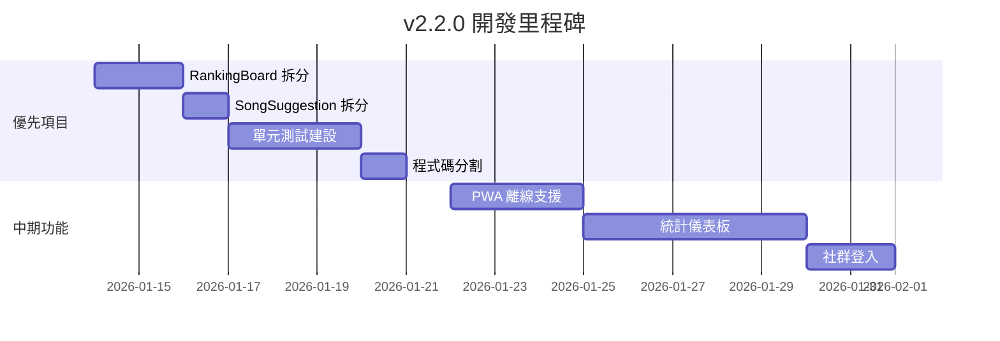

# 🚀 互動式吉他彈唱點播平台 - 未來開發詳細指南 v2

> **文件版本**: 2.0  
> **更新日期**: 2026-01-13  
> **當前版本**: v2.1.0  
> **目的**: 基於 v2.1.0 完成進度，提供下一階段的具體開發建議

---

## 📋 目錄

1. [v2.1.0 完成進度回顧](#v210-完成進度回顧)
2. [下一步優先項目 (建議順序)](#下一步優先項目)
3. [中期功能擴展](#中期功能擴展)
4. [長期進階功能](#長期進階功能)
5. [技術債務清理](#技術債務清理)
6. [部署與監控](#部署與監控)

---

## ✅ v2.1.0 完成進度回顧

| 項目 | 狀態 | 產出檔案 |
|------|------|----------|
| SongList 元件拆分 | ✅ 完成 | 8 個獨立模組 |
| 網路狀態監控 | ✅ 完成 | `use-network-status.ts`, `NetworkStatusBanner.tsx` |
| Firebase Performance | ✅ 完成 | `performance.ts` |
| TypeScript 嚴格模式 | ✅ 已啟用 | `tsconfig.json` |
| 標籤系統遷移 | ✅ 已完成 | `use-tags.ts` |
| 錯誤處理模組 | ✅ 已完成 | `error-handler.ts` |

---

## 🎯 下一步優先項目

### 優先級 1：RankingBoard 元件拆分 (3-4 小時)

**現況問題**：`RankingBoard.tsx` 約 49KB，需要拆分

**建議拆分結構**：

```
components/RankingBoard/
├── index.ts                 (導出入口)
├── RankingBoard.tsx         (主容器，約 200 行)
├── RankingItem.tsx          (單一排名項目)
├── RankingPodium.tsx        (前三名特殊顯示)
├── RankingAnimations.tsx    (排名變化動畫)
├── FireworkEffect.tsx       (煙火特效 - 已存在)
└── hooks/
    └── useRankingData.ts    (數據邏輯)
```

**實施步驟**：

1. 建立 `components/RankingBoard/` 目錄
2. 抽取 `RankingItem` 元件
3. 抽取 `RankingPodium` 前三名元件
4. 建立 `useRankingData` Hook
5. 整合並驗證

---

### 優先級 2：SongSuggestion 元件拆分 (2-3 小時)

**現況問題**：`SongSuggestion.tsx` 約 34KB

**建議拆分結構**：

```
components/SongSuggestion/
├── index.ts
├── SongSuggestion.tsx       (主容器)
├── SuggestionForm.tsx       (建議表單)
├── SuggestionCard.tsx       (單一建議卡片)
├── SuggestionFilters.tsx    (篩選狀態)
└── hooks/
    └── useSuggestions.ts    (建議數據 - 已存在)
```

---

### 優先級 3：單元測試基礎建設 (4-6 小時)

**目標**：建立測試框架並達到 20% 覆蓋率

**安裝依賴**：

```bash
npm install -D vitest @testing-library/react @testing-library/jest-dom jsdom @testing-library/user-event
```

**配置 vitest**：

```typescript
// vite.config.ts 新增
export default defineConfig({
  test: {
    globals: true,
    environment: 'jsdom',
    setupFiles: './src/test/setup.ts',
    coverage: {
      provider: 'v8',
      reporter: ['text', 'json', 'html'],
    },
  },
});
```

**優先測試的模組**：

| 模組 | 優先級 | 原因 |
|------|--------|------|
| `useSongSearch` | ⭐⭐⭐ | 純邏輯 Hook |
| `useVoting` | ⭐⭐⭐ | 核心功能 |
| `error-handler` | ⭐⭐ | 工具函式 |
| `SongCard` | ⭐⭐ | UI 元件 |

**範例測試**：

```typescript
// components/SongList/useSongSearch.test.ts
import { renderHook, act } from '@testing-library/react';
import { describe, it, expect } from 'vitest';
import { useSongSearch } from './useSongSearch';

const mockSongs = [
  { id: '1', title: '告白氣球', artist: '周杰倫', voteCount: 10 },
  { id: '2', title: '稻香', artist: '周杰倫', voteCount: 8 },
  { id: '3', title: '小幸運', artist: '田馥甄', voteCount: 5 },
];

describe('useSongSearch', () => {
  it('should filter songs by title', async () => {
    const { result } = renderHook(() => useSongSearch(mockSongs));
    
    act(() => {
      result.current.setSearchTerm('告白');
    });
    
    // 等待 debounce
    await new Promise(r => setTimeout(r, 350));
    
    expect(result.current.filteredSongs).toHaveLength(1);
    expect(result.current.filteredSongs[0].title).toBe('告白氣球');
  });

  it('should filter songs by artist', async () => {
    const { result } = renderHook(() => useSongSearch(mockSongs));
    
    act(() => {
      result.current.setSearchTerm('周杰倫');
    });
    
    await new Promise(r => setTimeout(r, 350));
    
    expect(result.current.filteredSongs).toHaveLength(2);
  });
});
```

---

### 優先級 4：程式碼分割 (Code Splitting) (2 小時)

**目標**：減少初始 Bundle 大小從 1056KB 到 < 600KB

**實施方式**：

```typescript
// App.tsx 或 Home.tsx
import { lazy, Suspense } from 'react';
import { Skeleton } from '@/components/ui/skeleton';

// 延遲載入大型元件
const RankingBoard = lazy(() => import('@/components/RankingBoard'));
const SongSuggestion = lazy(() => import('@/components/SongSuggestion'));
const MusicPlayer = lazy(() => import('@/components/MusicPlayer'));

function LoadingFallback() {
  return (
    <div className="p-4 space-y-3">
      <Skeleton className="h-8 w-full" />
      <Skeleton className="h-32 w-full" />
      <Skeleton className="h-8 w-3/4" />
    </div>
  );
}

// 使用
<Suspense fallback={<LoadingFallback />}>
  <RankingBoard songs={songs} />
</Suspense>
```

---

## 🚀 中期功能擴展 (2-4 週)

### 1. PWA 離線支援

**預估時間**：5-6 小時

**安裝**：
```bash
npm install vite-plugin-pwa -D
```

**配置重點**：

```typescript
// vite.config.ts
import { VitePWA } from 'vite-plugin-pwa';

export default defineConfig({
  plugins: [
    VitePWA({
      registerType: 'autoUpdate',
      manifest: {
        name: '吉他點歌平台',
        short_name: '點歌',
        theme_color: '#f59e0b',
        icons: [
          { src: 'pwa-192x192.png', sizes: '192x192', type: 'image/png' },
          { src: 'pwa-512x512.png', sizes: '512x512', type: 'image/png' }
        ]
      },
      workbox: {
        globPatterns: ['**/*.{js,css,html,ico,png,svg}'],
        runtimeCaching: [
          {
            urlPattern: /^https:\/\/firestore\.googleapis\.com\/.*/i,
            handler: 'NetworkFirst',
            options: { cacheName: 'firestore-cache' }
          }
        ]
      }
    })
  ]
});
```

---

### 2. 統計儀表板

**預估時間**：8-10 小時

**建議結構**：

```
components/StatsDashboard/
├── index.tsx            (主頁面)
├── QuickStats.tsx       (快速統計卡片)
├── TrendChart.tsx       (趨勢圖 - 使用 recharts)
├── TopSongsChart.tsx    (熱門歌曲)
├── HourlyHeatmap.tsx    (時段熱力圖)
└── hooks/
    └── useStats.ts      (統計 Hook)
```

**Firestore 資料結構**：

```typescript
// stats/{date}
interface DailyStat {
  date: string;           // "2026-01-13"
  totalVotes: number;
  uniqueVisitors: number;
  hourly: Record<string, number>;  // { "20": 45, "21": 62 }
  songs: Record<string, number>;   // { songId: voteCount }
}
```

---

### 3. 社群登入 (Google/Facebook)

**預估時間**：3-4 小時

**實施步驟**：

1. Firebase Console 啟用 Google/Facebook 登入
2. 擴充 `auth.ts`：

```typescript
// lib/auth.ts
import { 
  GoogleAuthProvider, 
  FacebookAuthProvider,
  signInWithPopup 
} from 'firebase/auth';

export async function signInWithGoogle() {
  const provider = new GoogleAuthProvider();
  return signInWithPopup(auth, provider);
}

export async function signInWithFacebook() {
  const provider = new FacebookAuthProvider();
  return signInWithPopup(auth, provider);
}
```

3. 更新 `LoginForm.tsx` 新增社群登入按鈕

---

## 🌟 長期進階功能 (1-3 個月)

| 功能 | 預估時間 | 複雜度 | 描述 |
|------|----------|--------|------|
| 歌詞同步播放 | 10-15 小時 | 高 | LRC 格式解析、同步播放 |
| 多語系 (i18n) | 6-8 小時 | 中 | react-i18next 整合 |
| 推播通知 | 8-10 小時 | 高 | Firebase Cloud Messaging |
| 權限管理 | 6-8 小時 | 中 | 角色分層 (guest/user/admin) |
| A/B 測試 | 4-5 小時 | 中 | 實驗框架建設 |

---

## 🔧 技術債務清理

### 待處理項目

| 項目 | 優先級 | 說明 |
|------|--------|------|
| 移除未使用的 react-query 呼叫 | 中 | 部分元件仍有殘留 |
| RankingBoard 元件拆分 | 高 | 49KB 過大 |
| 測試覆蓋率 | 高 | 目前 0% |
| Bundle 大小優化 | 中 | 目前 1056KB |
| CSS 模組化 | 低 | Tailwind 整理 |

### 已完成項目 ✅

- ✅ SongList 元件拆分 (1033 行 → 8 模組)
- ✅ TypeScript 嚴格模式
- ✅ 標籤系統 Firestore 遷移
- ✅ 錯誤處理模組
- ✅ 網路狀態監控
- ✅ Firebase Performance

---

## 🚢 部署與監控

### GitHub Actions CI 增強

```yaml
# .github/workflows/ci.yml
name: CI

on:
  push:
    branches: [main, develop]
  pull_request:
    branches: [main]

jobs:
  test:
    runs-on: ubuntu-latest
    steps:
      - uses: actions/checkout@v4
      - uses: actions/setup-node@v4
        with:
          node-version: '20'
          cache: 'npm'
      - run: npm ci
      - run: npm run check     # TypeScript
      - run: npm run test      # 單元測試
      - run: npm run build     # 建置驗證
```

### 監控儀表板

| 工具 | 用途 | 成本 |
|------|------|------|
| Firebase Analytics | 使用者行為 | 免費 |
| Firebase Performance | 效能指標 | 免費 |
| Sentry | 錯誤追蹤 | 免費方案可用 |
| Uptime Robot | 可用性監控 | 免費 |

---

## 📅 建議實施順序



---

## 📋 快速開始檢查清單

如果您想立即開始，建議從以下項目著手：

### 本週可完成

- [ ] RankingBoard 元件拆分 (半天)
- [ ] 安裝 vitest 並寫第一個測試 (2 小時)
- [ ] 實施程式碼分割 (2 小時)

### 下週規劃

- [ ] SongSuggestion 元件拆分
- [ ] 測試覆蓋率提升至 20%
- [ ] PWA 基礎配置

---

*此文件將隨專案進展持續更新*  
*最後更新：2026-01-13 v2.1.0*
